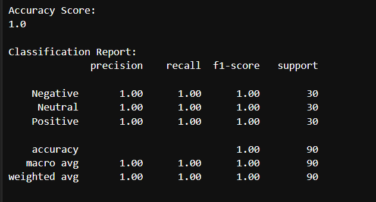
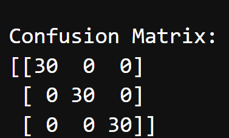
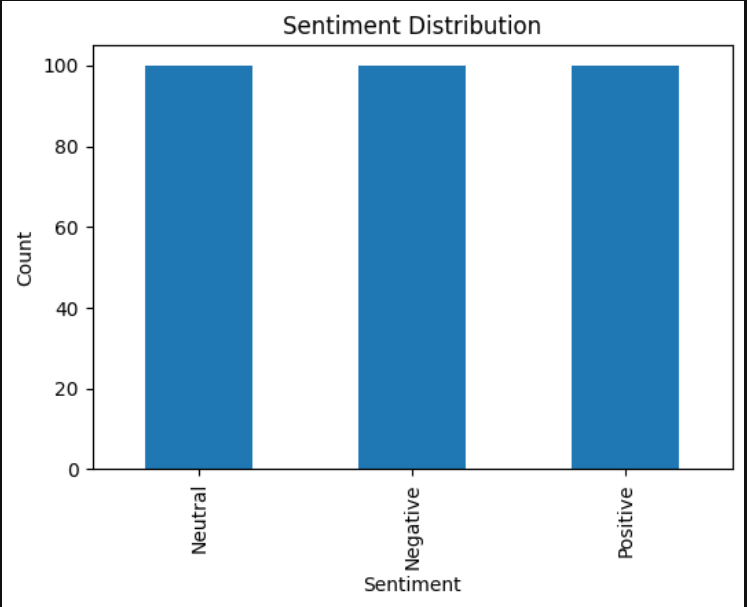
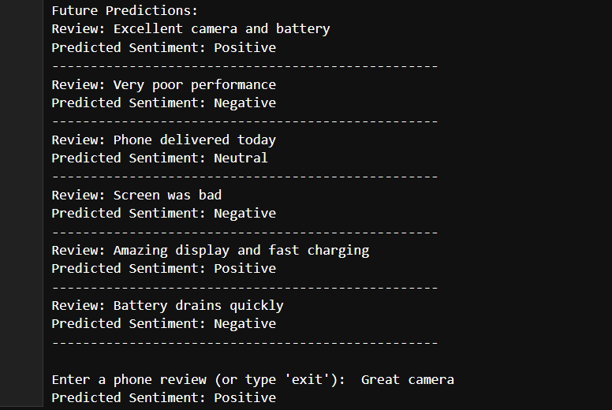

# 📱 Social Media Review Sentiment Analysis

## 📖 Project Overview

This project performs sentiment analysis on TechNova mobile customer reviews using Machine Learning and Natural Language Processing (NLP).

The model classifies customer reviews into different sentiment categories using **TF-IDF Vectorization** and **Logistic Regression**.

---

## 🚀 Features

- Load and explore customer review dataset
- Data preprocessing
- TF-IDF Vectorization
- Logistic Regression model
- Model evaluation using:
  - Accuracy Score
  - Classification Report
  - Confusion Matrix
- Sentiment Distribution Visualization
- Predict sentiment for new customer reviews
- Interactive user input prediction

---

## 🛠 Technologies Used

- Python
- Pandas
- NumPy
- Matplotlib
- Scikit-learn
- Jupyter Notebook

---

## 📂 Dataset

TechNova Mobile Customer Reviews Dataset (YBI Foundation)

---

## 📊 Machine Learning Workflow

1. Import Libraries
2. Load Dataset
3. Data Exploration
4. Train-Test Split
5. TF-IDF Vectorization
6. Logistic Regression Model Training
7. Model Evaluation
8. Future Predictions
9. User Input Prediction

---

## ▶️ How to Run

1. Install the required libraries:

```bash
pip install -r requirements.txt
```

2. Open `Sentiment_Analysis.ipynb` in Jupyter Notebook.

3. Run all cells.

---

## 📈 Future Improvements

- Build a Flask Web Application
- Deploy the model online
- Add Deep Learning (LSTM/BERT)
- Improve UI for predictions

---
## 📸 Project Output

### Accuracy Score



### Confusion Matrix



### Sentiment Distribution



### Future Predictions


